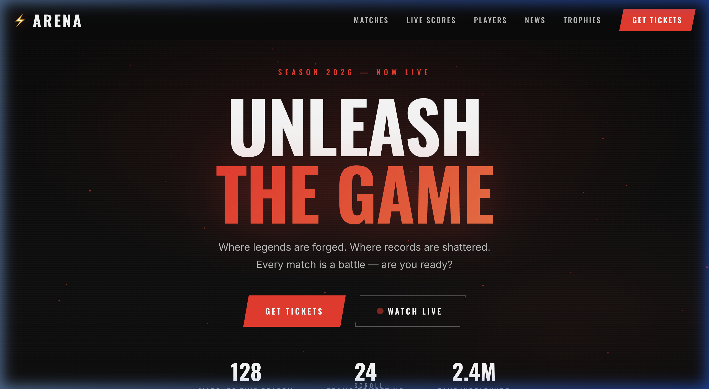
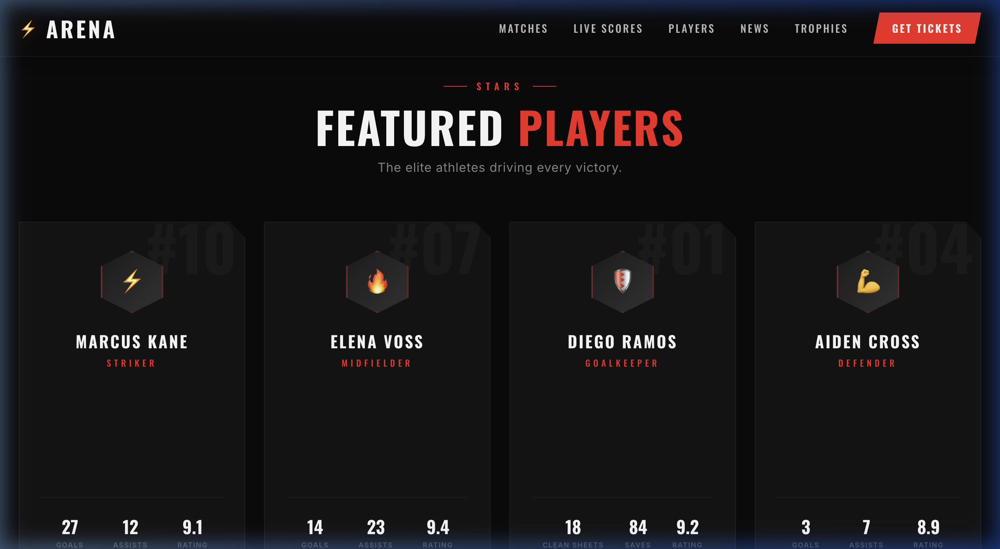
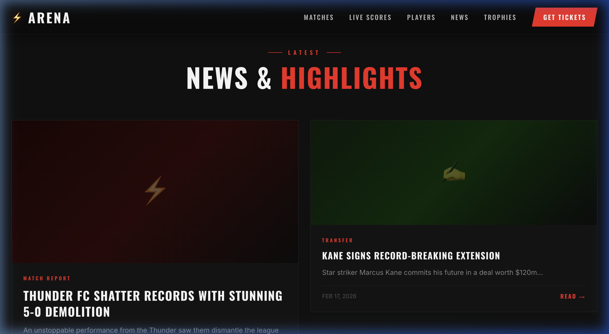
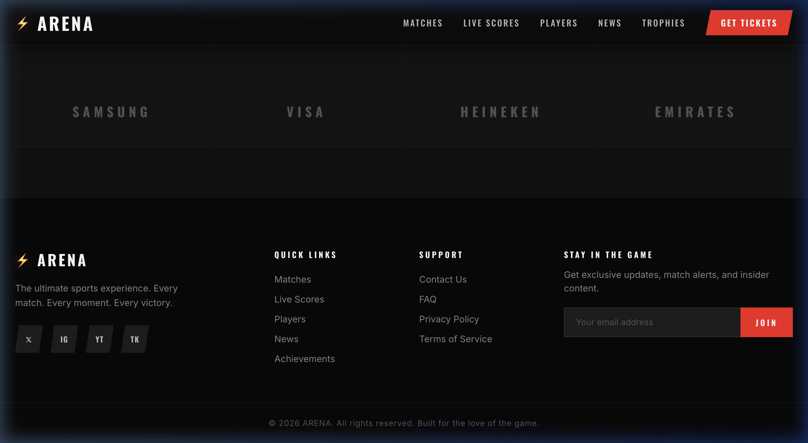

# ⚡ ARENA — Unleash the Game

A high-energy, dark-mode sports website with bold design, dynamic animations, and a stadium-night atmosphere. Built with pure **HTML**, **CSS**, and **JavaScript** — no frameworks, no dependencies.

🔗 **[View Live →](https://sonusharmafiles.github.io/arena-sports-website/)**

---

## 📸 Screenshots

### 🏟️ Hero Section


### ⚔️ Upcoming Matches


### ⭐ Featured Players & Live Scores


### 📰 News & Highlights


### 🏆 Sponsors & Footer


---

## ✨ Features

| Feature | Description |
|---------|-------------|
| 🌑 **Dark Mode** | Deep black (#0B0B0B) background with electric red (#FF1E1E) accents |
| ⏱️ **Live Countdowns** | Real-time countdown timers for each upcoming match |
| 📊 **Animated Stat Bars** | Player performance stats animate on scroll |
| 🔢 **Dynamic Counters** | Trophy numbers count up with easing when scrolled into view |
| 📡 **Live Scores Ticker** | Horizontally scrolling ticker with real-time match scores |
| 🎆 **Floating Particles** | 50 animated red particles in the hero background |
| 🖱️ **Mouse Parallax** | Hero content subtly follows cursor movement |
| 📱 **Fully Responsive** | Optimized for desktop, tablet, and mobile |
| ✂️ **Sharp Edges** | Clip-path polygon cuts on buttons, cards, and avatars |
| 🎬 **Scroll Reveal** | Staggered slide-in animations for all sections |

---

## 🛠️ Tech Stack

- **HTML5** — Semantic structure
- **CSS3** — Custom properties, clip-path, keyframe animations, CSS Grid & Flexbox
- **JavaScript** — IntersectionObserver, dynamic counters, countdown timers, particle system
- **Google Fonts** — Oswald (display) + Inter (body)

---

## 📂 Project Structure

```
arena-sports-website/
├── index.html          # Main page structure
├── styles.css          # Design system & all styles
├── script.js           # Interactivity & animations
├── screenshots/        # Website screenshots
└── README.md
```

---

## 🚀 Getting Started

Just clone and open — no build step required:

```bash
git clone https://github.com/SonuSharmaFiles/arena-sports-website.git
cd arena-sports-website
open index.html
```

---

## 📄 License

Open source — feel free to use, modify, and share.

---

<p align="center">
  <b>Built with 🔥 for the love of the game.</b>
</p>
